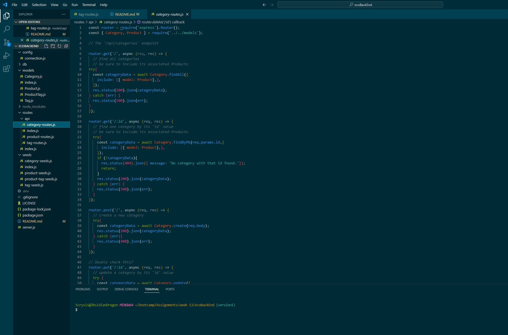

# ecoBackEnd
E-commerce back end assignent

Repository found at: https://github.com/Scrysis/ecoBackEnd

Video link: (Video link to go here when done processing)

This is a bootcamp assignment to link a functioning front end application to the backend mySql database
 using Sequelize.

To this end, a good number of things were already filled out, but class models and routes were left incomplete.
It was my task to fill in these missing pieces.
